# 03 · 共享面写入管控（Shared Surface Control）

> 📇 **先读索引卡**：`index/03-shared-surface-control.md`（≤30 行速览 + 按节读取指引，避免整读）。会话卫生纪律：Read 带 offset/limit。


> **本文是全团队最硬的一篇**：它把「不要乱改共享模块」从倡议变成**闸门**。
> 唯一真相源：[`shared-contracts.md`](../../docs/shared-contracts.md)（清单与日志）+ 本文（面域、权限、流程、门禁）。

---

## 1. 面域分级（Surface Tiers）

| 级别 | 面 | 路径 | 写入要求 |
|---|---|---|---|
| **C1** | 共享核心 | `packages/shared-types/**`、`packages/llm/**`、`packages/config/**`、`packages/utils/**`、`services/**`（auth/payment/llm/boss/telemetry）、`matrix.config.schema.json`、`pnpm-workspace.yaml`、`tsconfig.base.json`、`package.json`、`.github/**`、`.env.example` | **WO + 资深风控师核准 + 共享锁**；破坏性 → 事前 **INTENT** + 兼容证明；改后当日登记；**全矩阵 typecheck/test/build 必绿** |
| **C2** | 共享外围 | 其余 `packages/**`（如 `telemetry`、`ui`、`sdk-client`）、`scripts/**`、`infra/**`（含 `cloudbase/migrations`）、**根 `docs/**`（全部）**<br/>其中 ★ 契约类：`docs/architecture.md`、`docs/shared-contracts.md`、`docs/brd-standard.md`、`docs/app-onboarding.md`、`docs/deploy*.md`、`docs/llm-service.md`、`docs/cloudbase-integration.md` | **WO（轻单）+ 资深风控师核准 + 共享锁**；改后当日登记；回归范围由守卫裁定（纯文档通常免跑全矩阵）<br/>★ 额外要求：**同一次提交必须同步对应 Role Skill 的 `references/`**（`guard check` 会提示；见下文 1.1） |
| **C3** | App 私有受控 | `apps/<app>/matrix.config.json`、`apps/<app>/.env.example`、`apps/<app>/docs/<App>_{BRD,PRD,TDD}_*.md` | App 责任角色可写；**跨 App 影响时必须开 WO**；PRD/TDD 重大修订需主理人知会 |
| **F** | 自由面 | `apps/<app>/src/**`、`apps/<app>/packages/**`、`apps/<app>/scripts/**`、`apps/<app>/public/**` | 直接改，无需 WO；仍需通过 QA 门禁（typecheck/test/build） |
| **C2** | **专家团资产**（改 Agent 行为 = 影响全矩阵） | `<team-repo>/aimatrix-*/**`（角色 Skill 正文与 references）、`<team-repo>/members/**`（成员真源）、`<team-repo>/scripts/**`（guard / inspect / expert-sync / DR 生成器）、`<team-repo>/docs/**`（治理规范与模板） | **WO + 资深风控师核准 + 共享锁**；改后当日登记；回归范围由守卫裁定（改 Skill 正文 ≥ 至少跑一次受影响角色的示例任务；改 `scripts/` 必须跑脚本自测） |
| **T** | 台账面 | `<project>/.ai-matrix-team/runtime/**`（WO / DR / 台账 / 交接单 / 巡检报告） | 任何角色可写，**格式必须套模板**；由 `guard` 校验字段完整性；`runtime/state/` 为机器写（锁、日志），**不入库** |
| **—** | 软链（非源码） | `<project>/.workbuddy/skills/aimatrix-*` → `<team-repo>/aimatrix-*` | **不入库、禁止手改**；由 `<team-repo>/scripts/install-to-workbuddy.mjs` 生成与校验（`--check`） |

> **判定原则**：吃不下面域的路径 → 按**更高级别**处理（从严）。
> **查询**：`node <team-repo>/scripts/aimatrix-guard.mjs surface <path...>` 直接打印每个路径的级别与要求。

### 1.1 为什么根 `docs/**` 整体降到 C2

文档修订是全矩阵最高频的写操作。若把根 docs 全部抬到 C1，每次改一句文档都要跑全矩阵 build，团队会把「顺手改文档」变成「绕过流程」，反而制造更多违规。因此：

| 项 | 决定 |
|---|---|
| 根 `docs/**` **全部**归入 **C2**（轻单） | 不开单仍需批准；但**不再强制**全矩阵 typecheck/test/build，回归范围由资深风控师按实际影响裁定（纯 Markdown 通常免跑） |
| ★ 契约类文档（见上表）加一道**软门禁** | 改这些文档时，同一次提交里必须更新**对应 Role Skill 的 `references/` 或正文**（映射见 [`02-roles.md`](02-roles.md) §9）；`guard check` 发现「改了 ★ 文档但没动任何 Skill」→ 退出码 6 提示（**不阻塞**，交由资深风控师在核准时判定是否放行） |
| 降级不等于放开 | C2 仍然：**必须开 WO + 资深风控师核准 + 持共享锁 + 当日登记**。脱管的只是「要不要跑全矩阵构建」，不是「能不能写」 |

> **一句话**：C1 管的是「改了会炸」的东西（代码/契约/配置）；文档放进 C2，管的是「可见 + 留痕 + 规范同步」。

---

## 2. 权限矩阵（角色 × 面域）

图例：✅ 可在 WO 授权内写 · 🅦 需 WO + 资深风控师逐次核准 · 👁 只读 · ⛔ 禁止

| 角色 | C1 | C2 | C3 | F | T |
|---|---|---|---|---|---|
| PC（产研高级总监） | **✅（守门人）** | **✅** | ✅（知会） | 👁 | ✅（台账 owner） |
| 毛毛（资深产品设计师） | ⛔ | ⛔ | ✅（仅 BRD / PRD / 设计稿） | 👁 | ✅ |
| Bruce（资深研发工程师） | 🅦（白名单内，含架构速断） | 🅦 | ✅ | ✅ | ✅ |
| 石头（资深质检工程师） | 🅦（仅测试/验收报告） | 🅦（仅测试） | 👁 | 🅦（仅测试） | ✅ |
| 波波（资深运维工程师） | 🅦（部署配置/env） | ✅（部署记录） | 👁 | 👁 | ✅ |
| 创始人（人类） | ✅（建议也开 WO 留痕） | ✅ | ✅ | ✅ | ✅ |

> **守门人的自我约束**：团长（PC）拥有 C1/C2 写入权，但① 必须留 WO；② 破坏性变更仍需 **INTENT + 创始人知会**；③ 所有写入当日登记、可回溯。守门人不是「免检」，是「留痕且可被审计」。

---

## 3. 任务单（Work Order, WO）

### 3.1 何时必须开单

- 触碰 **C1 / C2** → **必须**
- C3 且跨 App 有影响 → 必须
- 仅 F（App 内源码） → 不开单（但交接入交接单）
- 任何需要部署 / 迁移 / 改 CORS 的动作 → 必须

### 3.2 字段（模板见 [`templates/wo.md`](templates/wo.md)）

| 字段 | 说明 |
|---|---|
| `id` | `WO-YYYYMMDD-<seq>-<slug>`（当日序号两位数） |
| 申请人 / 执行角色 / 资深风控师 | 三个签名位 |
| 目的与背景 | 一句话 + 关联 BRD/PRD/TDD/ADR 章节 |
| **面域与路径白名单** | 逐条列出允许写入的路径（glob）；白名单外改动 = 违规 |
| **变更类型** | additive（只增）/ 非破坏 / **破坏性** / 新增契约 |
| **影响面** | 哪些 App / 服务 / 在线产物受影响 |
| **验证方式** | 具体命令与判定（如 `pnpm -r typecheck` 全绿 + `/me/entitlement` 200） |
| **回滚方案** | 可执行的回退动作 |
| **关联 DR** | 需人类拍板的决策项 id（BLOCKING 必须列出） |
| 状态 | 见 3.3 |

### 3.3 状态机

```mermaid
stateDiagram-v2
  [*] --> DRAFT: 主理人开单
  DRAFT --> APPROVED: 资深风控师核准(C1/C2)
  DRAFT --> REJECTED: 缺影响面/验证/回滚
  APPROVED --> LOCKED: 抢到共享锁
  LOCKED --> IMPLEMENTING: Bruce开工
  IMPLEMENTING --> VERIFYING: 门禁提交
  VERIFYING --> BLOCKED_DR: 存在未闭环 BLOCKING DR
  BLOCKED_DR --> VERIFYING: 人类答复后回填
  VERIFYING --> DONE: QA 放行 + 契约登记 + 交接单
  DONE --> [*]: 释放锁并归档
```



- **存放**：`<project>/.ai-matrix-team/runtime/workorders/WO-*.md`；归档移 `<project>/.ai-matrix-team/runtime/workorders/closed/`
- **索引**：`<project>/.ai-matrix-team/runtime/workorders/INDEX.md`（活跃 WO 一览：id / 面域 / 持有人 / 锁 / 关联 DR / 状态）

---

## 4. 串行锁（Shared Lock · 按面域分片）

落实 `shared-contracts.md` §2-3「串行优先」；**2026-10-06 起按面域分片**（`DR-20261006-012` 裁定 A）：面域**不相交**的多个 WO 可同时持锁，**同面域仍互斥**。

- **状态文件**：`<project>/.ai-matrix-team/runtime/state/lock.json`（schema 2，**多持有者**）
  ```json
  {
    "schema": 2,
    "holders": [
      {
        "wo": "WO-YYYYMMDD-NN-<slug>",
        "surfaces": ["packages/shared-types", "services/payment"],
        "acquiredAt": "2026-10-05T14:20:00+08:00",
        "ttlMinutes": 240,
        "renewable": true
      }
    ],
    "holder": "WO-YYYYMMDD-NN-<slug>",
    "surfaces": ["packages/shared-types", "services/payment"],
    "acquiredAt": "2026-10-05T14:20:00+08:00",
    "ttlMinutes": 240,
    "renewable": true
  }
  ```
  > 顶层 `holder` / `surfaces` / `acquiredAt` / `ttlMinutes` / `renewable` 是**主持有者（`holders[0]`）的 legacy 镜像**——保留给未适配 `holders[]` 的历史消费者，也是 `git revert` 回滚到旧 guard 的硬前提（无镜像则回滚后会把已持锁**误判为空闲**）。读侧兼容 `holders[]` 与 legacy 单持有者两种残留；`holders` 为空时删除该文件。
- **规则**：
  1. **按面域分片**：多个 WO 可同时持锁，**前提是各自 C1/C2 冲突面两两不相交**；同面域（相交）仍互斥。holder 的冲突面 = 其白名单在 **C1/C2** 面域的子集（**T/F/S 路径不计入**——锁只序列化 C1/C2 写入；否则凡共用 `<project>/.ai-matrix-team/runtime/**`（T 面）的单会恒相交）。C1/C2 写入前必须持锁。
  2. 锁有 TTL（默认 4h，可续）；**TTL 过期自动释放**并写入 `guard.log`，防止「忘记释放」把全团队堵死。
  3. **面域相交才排队**：新单面域与在持单冲突面相交时，守卫拒绝 `acquire` 并报出**相交的 glob 对**—— newcomer 要么等、要么只做 F 面工作；**面域不相交者无须排队，可并行持锁**。
  4. **紧急热修例外**：生产事故可先修（走 W6），**24h 内补 WO 与登记**，并在交接单标注 `EXCEPTION`。
- **命令**：
  ```bash
  node <team-repo>/scripts/aimatrix-guard.mjs lock status
  node <team-repo>/scripts/aimatrix-guard.mjs lock acquire --wo WO-YYYYMMDD-NN-<slug> --surfaces packages/shared-types
  node <team-repo>/scripts/aimatrix-guard.mjs lock renew  --wo WO-YYYYMMDD-NN-<slug>
  node <team-repo>/scripts/aimatrix-guard.mjs lock release --wo WO-YYYYMMDD-NN-<slug>
  ```

---

## 5. 契约登记与 INTENT

| 变更类型 | 事前 | 事后 |
|---|---|---|
| additive / 非破坏 | WO 里声明 | **当日**追加 `shared-contracts.md` §3 日志（追加式，不改历史） |
| **破坏性**（对外签名/语义/删除/重命名） | WO + **`shared-contracts.md` §3 追加 `INTENT` 条目**（影响面 + 验证方式）+ Bruce兼容证明 | 同上，且 INTENT 条目标注已执行与验证结果 |
| 新增契约（如新公共服务/新包） | WO + ADR | 登记进 §1 共享面清单 |

**登记字段**（沿用既有表头）：日期 · 变更者（WO 号）· 契约 · 类型 · 内容 · 影响面与验证。
**新增一列**：`WO`（便于从台账反查任务单）。

---

## 6. 机器门禁：`aimatrix-guard`

**位置**：`<team-repo>/scripts/aimatrix-guard.mjs`（仓库内，零第三方依赖，Node 22 直跑）。
**规则源**：本文件 §1 面域表（脚本内置同一份清单，`guard` 与文档**共用**一个 `surfaces.json`，避免漂移）。

| 子命令 | 作用 | 退出码 |
|---|---|---|
| `surface <paths...>` | 打印每个路径的面域级别与写入要求（诊断用） | 0 |
| `check --wo <id> --paths <paths...>` | 写入前校验：路径在白名单内？持锁？WO 状态？ | 0 通过 / 2 越权 / 3 缺锁或锁冲突 |
| `lock <acquire\|renew\|release\|status> --wo <id>` | 串行锁 | 0 / 3 |
| `dr scan [--wo <id>] [--blocking]` | 扫描未闭环 DR | 0 无 / 4 存在未闭环（BLOCKING） |
| `wo lint <file>` | WO/DR/交接单字段完整性 | 0 / 5 字段缺失 |
| `sync-check` | 本次改动含 ★ 契约类文档时，是否同步了对应 Skill | 0 / 6 疑似未同步（提示级，守卫裁决） |
| `audit --since <sha>` | git diff 路径 × 受控面 × 活跃 WO → 找出**无单写入** | 0 / 2 |
| `report` | 当前在办 WO / 锁 / DR 摘要（主理人每 Phase 用） | 0 |

**四个接入点（缺一不可）**：

1. **Agent 自检**（最重要）：每个角色 Skill 的硬步骤里写明——写受控面前先跑 `surface`；动 C1/C2 前先跑 `check`。
2. **pre-commit**（本地）：`.githooks/pre-commit` 跑 `check`（快路径：只校验暂存文件路径）+ `git config core.hooksPath .githooks`。
3. **CI**：`.github/workflows/ci.yml` 增 job `governance` —— PR 时跑 `audit`（无单写入即失败）；push main 跑 `dr scan`（仅报告，不阻塞）。
4. **主理人阶段门禁**：每 Phase 结束 `report`，把结论写进 WO。

**设计底线**：门禁**不追求拦住恶意**（Agent 可以绕过脚本改文件），而追求**让违规可见且可追责**——`audit` 每次 CI 都跑，无单写入在 PR 里暴露。

---

## 7. 违规处置

| 场景 | 判定 | 处置 |
|---|---|---|
| 无 WO 改了 C1/C2 | 违规（CI `audit` 报出） | 立即停手 → 补开 WO（标注 `RETRO`）→ 补登记 → 主理人在交接单记一次「流程事故」 |
| 越出 WO 路径白名单 | 违规 | 回退该部分改动或补白名单（需守卫核准） |
| 破坏性变更未 INTENT | 严重违规 | 回滚 + 走 W3 重来 + ADR 记录 |
| 忘记释放锁 | 轻违规 | TTL 自动释放；连续两次 → 通报创始人 |
| 台账（WO/DR）字段缺失 | 格式违规 | `wo lint` 退出码 5，补齐方可进入下一阶段 |

---

## 8. 落盘布局（两仓全貌）

```text
<team-repo>/                        ai-matrix-team 独立仓库，全部入库
├── SKILL.md                        安装器技能（agent 读它即知如何接入项目）
├── README.md                       一页概览 + 团队总览图
├── members/                        成员真源（五席，一席一份；expert-sync 的类）
├── assets/                         图：team-overview.svg
├── docs/                           治理规范（本文所在）
│   ├── 01-charter.md … 08-portability.md
│   ├── index/                      各篇索引卡（先读卡再读正文）
│   └── templates/                  WO / DR / 交接单 模板（唯一格式源）
├── scripts/                        可执行物（零第三方依赖）
│   ├── install-to-workbuddy.mjs    Skill 软链安装/校验/卸载（--project）
│   ├── install-to-workbuddy.command / .sh   双击 / POSIX 薄壳
│   ├── aimatrix-guard.mjs          门禁 CLI（--project）
│   ├── aimatrix-inspect.mjs        合规巡检 CLI
│   ├── expert-sync.mjs             成员真源 → 专家包全链同步
│   ├── new-dr.mjs / ledger-sync.mjs / render-open-items.mjs
│   └── surfaces-default.json       面域默认规则（项目可覆盖）
├── dashboard/                      操盘台（Vite + React，--project 读项目薄层）
└── aimatrix-*/                     角色 Skill（SKILL.md + references/ + examples/ + scripts/）
    aimatrix-intake｜product-designer｜developer｜qa｜devops
    aimatrix-architect（开发深读）｜guardian（守门手册）
    aimatrix-guard｜aimatrix-decision（跨角色工具）

<project>/.ai-matrix-team/          项目薄层（项目仓入库；runtime/state/ 除外）
├── project.json                    项目档案（init 生成：apps/面域/规范绑定/术语表）
├── surfaces.json                   面域规则（可覆盖团队默认；与 docs/03 §1 同源）
└── runtime/                        运行台账（入库）
    ├── workorders/  ├── decisions/  ├── handoffs/  └── reviews/
<project>/.ai-matrix-team/runtime/state/   机器写（lock.json / guard.log / instances.json），gitignore

<project>/.workbuddy/skills/aimatrix-*  ← 软链，**不入库、禁止手改**（install 脚本生成）
```

> **单一真相源纪律**：团队仓与项目薄层里任何文件都只有这一份。`.workbuddy/skills/` 是软链、`.bak-<ts>` 是冲突备份——**手改激活点或副本 = 违规**（`install-to-workbuddy.mjs --check` 会查出软链漂移；处置见 §7）。
> **surfaces 与 §1 表格同源**：改一处须同步另一处，`guard` 启动时自检一致性。
