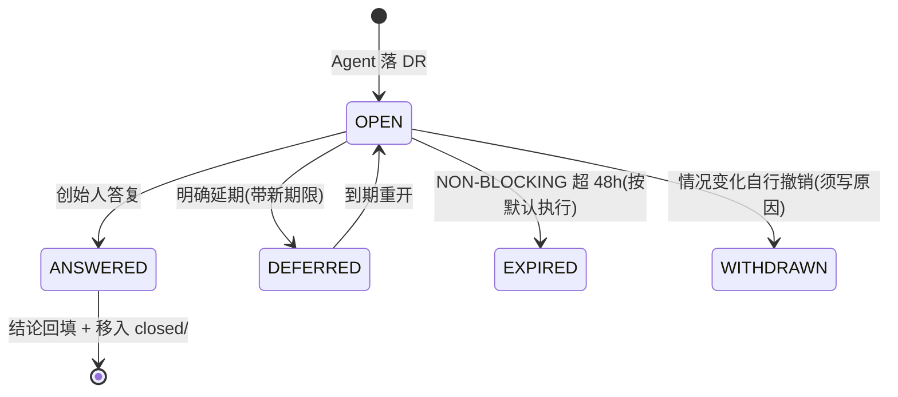

# 04 · 人类决策落盘规范（Decision Request Protocol）

> 📇 **先读索引卡**：`index/04-decision-protocol.md`（≤30 行速览 + 按节读取指引，避免整读）。会话卫生纪律：Read 带 offset/limit。


> **一句话**：Agent 遇到「只有人能决定」的事，不许自行假设，也不许在聊天里随口一问就算——**必须落一张 DR**，进台账，带默认建议，BLOCKING 的必须等答复。
> 本文是**矩阵级规范**；各 App 的 `OPEN-ITEMS.md` 是它的「人类阅读视图」（§7）。

---

## 1. 三个概念不许混

| 东西 | 时态 | 放哪 | 谁写 |
|---|---|---|---|
| **DR**（Decision Request） | **待决策**（现在时） | `<project>/.ai-matrix-team/runtime/decisions/open/DR-*.md` | Agent 提，人答 |
| **ADR**（Architecture Decision Record） | **已决策**（过去时） | `docs/decisions/ADR-*` | Bruce（结论落地后） |
| **OPEN-ITEMS.md** | 叙述式待办清单 | `apps/<app>/docs/OPEN-ITEMS.md` | 由 DR 台账驱动生成/同步 |

**流向**：DR 被答复 → 结论回填 BRD/PRD/TDD 或升格为 ADR → DR 移入 `closed/` → LEDGER 标 ✅ → OPEN-ITEMS 同步。

---

## 2. 六类触发（命中任一，必须落 DR）

| # | 类型 | 举例 | 默认阻塞级别 |
|---|---|---|---|
| **D1** | **不可逆承诺**（Type 1） | 永久免费承诺、对外定价、品牌承诺、儿童隐私/合规口径 | **BLOCKING** |
| **D2** | **需要人类凭据 / 资金 / 账号操作** | Dodo 后台建商品、云迁移执行、绑 ICP 备案域名、购买付费素材、开通 CAM 权限 | **BLOCKING** |
| **D3** | **跨 App 影响的技术选型 / 破坏性变更** | 新增公共服务、上收能力为矩阵级、`AppId` 重命名、档位模型变更 | BLOCKING（破坏性）/ NON-BLOCKING（additive 带建议） |
| **D4** | **目标或资源冲突** | 两 App 争同一共享资源、优先级冲突、同一契约两个 WO 都想改 | **BLOCKING** |
| **D5** | **事实缺失且无法自行获取** | 市场规模数据、法务口径、创始人未公开的排期 | NON-BLOCKING（带假设与 Plan B） |
| **D6** | **触碰红线** | 生产环境写操作、默认域上生产、合规风险、成本超阈值 | **BLOCKING** |

> **不属于 DR 的**（不许拿来打扰人）：技术栈内可自决的选择（既有统一栈已定）、代码风格、测试粒度、文件组织——按既有规范自行决定，写进交接单「我已替你决定」段即可。

---

## 3. 字段规范（模板见 [`templates/dr.md`](templates/dr.md)）

| 字段 | 要求 |
|---|---|
| `id` | `DR-YYYYMMDD-NNN`（当日三位序号） |
| 提出者 | 角色 + Agent ID |
| 所属 | WO 号 / App / 契约（三选一必填） |
| **决策类型** | Type 1（不可逆）/ Type 2（可逆） |
| **阻塞级别** | BLOCKING / NON-BLOCKING |
| **问题** | 一句话，必须是**可回答的判断题或选择题** |
| **为什么需要你** | 明确写「我做不了」还是「不该替你决定」 |
| **选项表** | ≥2 个方案：代价 / 收益 / 推荐（标 ✅） |
| **建议默认值** | 人回一句「按默认」就能推进的那个值 |
| **不做的后果 / 超时行为** | NON-BLOCKING 写「48h 无答复按默认执行」；BLOCKING 写「任务停在这里」 |
| 影响面 | 哪些 App / 服务 / 已上线产物 |
| 关联文档 | BRD §x / PRD §y / ADR / WO |
| 状态与答复 | OPEN → ANSWERED / DEFERRED / WITHDRAWN / EXPIRED + 答复原文与日期 |

---

## 4. 状态机



**硬纪律**：

1. **BLOCKING DR 不闭环，相关 WO 不得进入下一阶段**（章程 T2）——门禁：`node <team-repo>/scripts/aimatrix-guard.mjs dr scan --blocking --wo <id>`，退出码 4 即停。
2. **Type 1 不许沉默通过**（沿用 `brd-standard.md` C4）：BLOCKING 项**不会**因为超时自动按默认执行，必须显式答复。
3. **NON-BLOCKING 可超时按默认推进**，但必须在 LEDGER 标注「按默认执行 + 日期」，且结论可被推翻（推翻代价写进 DR）。
4. **谁提出谁回填**：答复后由提出者把结论写回 BRD/PRD/TDD/代码注释/`shared-contracts.md`，再关闭 DR。**不许「答复了但没落地」**。
5. **当轮通报**：主理人不得攒 DR，BLOCKING 项在产生的那一轮就告知创始人。

---

## 5. 落盘与命名

```text
decisions/
├── LEDGER.md                     # 机读台账（唯一真相源）
├── open/DR-20261005-001-xxxx.md
└── closed/DR-20261004-003-yyyy.md
```

**LEDGER.md 表头**（脚本 `<team-repo>/scripts/ledger-sync.mjs` 自动维护，Agent 只写 DR 文件、跑一次同步）：

| id | 提出者 | 所属 WO/App | 一句话 | 类型 | 阻塞 | 状态 | 提出日 | 期限 | 答复日 |
|---|---|---|---|---|---|---|---|---|---|

**脚本**（`aimatrix-decision` Skill）：
- `<team-repo>/scripts/new-dr.mjs --title ... --type 1 --blocking --wo ...` → 生成 id + 文件骨架
- `<team-repo>/scripts/ledger-sync.mjs` → 扫描 `open/`、`closed/` 重建 LEDGER.md
- `<team-repo>/scripts/render-open-items.mjs --app <app>` → 从 LEDGER 渲染 `apps/<app>/docs/OPEN-ITEMS.md`

---

## 6. 人类答复通道（三选一，等价）

1. **聊天一句话**：「DR-20261005-001 按默认」/ 「选方案 B」→ Agent 回填并关闭。
2. **直接编辑 DR 文件**：在「答复」段写下结论 → Agent 下次扫到即生效。
3. **操盘台页面**（可选增强，二期）：勾选选项后写回 `decisions/open/*.json`。

> 答复必须有**原文留痕**（谁、哪天、选了什么），不许只留结论不留依据。

---

## 7. 与 `OPEN-ITEMS.md` 的关系（防两份漂移）

`apps/lucia/docs/OPEN-ITEMS.md` 已被证明是**非常好用的**人类视图（A 拍板 / B 提供 / C 选型 / D 我替你决定 / E 下一步 / F 风险登记）。保留它，但加两条约束：

1. **DR 是唯一真相源**：OPEN-ITEMS 里的 A/B/C 每一条 **必须带 DR id**；没有 id 的条目 = 未登记，24h 内补 DR。
2. **OPEN-ITEMS 是渲染产物**：由 `<team-repo>/scripts/render-open-items.mjs` 从 LEDGER 生成骨架（A/B/C/D/F 分节映射），Agent 再补叙述细节；**禁止手改台账数据**（改了会被下次渲染覆盖）。

| OPEN-ITEMS 分节 | 对应 DR 类型 |
|---|---|
| A. 需要你拍板（Type 1） | D1（BLOCKING） |
| B. 需要你提供（凭据/资源） | D2（BLOCKING） |
| C. 需要你做技术选型 | D3 |
| D. 我已替你决定、你可推翻 | 非 DR（写进交接单即可；若可推翻代价高 → 升级为 D3） |
| F. 风险登记 | 非 DR（进 `<project>/.ai-matrix-team/runtime/reviews/` 或交接单「遗留风险」） |

---

## 8. 度量（用来判断这套机制有没有真跑起来）

| 指标 | 定义 | 目标 |
|---|---|---|
| DR 闭环率 | 已答复 / 总数（近 30 天） | ≥ 80% |
| BLOCKING 平均等待 | OPEN → ANSWERED 的天数 | ≤ 2 天 |
| 静默假设事故 | 「本该提 DR 却自行推进」被发现的次数 | 0（每次发现记一次流程事故） |
| 人均打扰量 | 每周新增 DR 数 | ≤ 8（超过说明门槛设低了，回来看 §2） |
