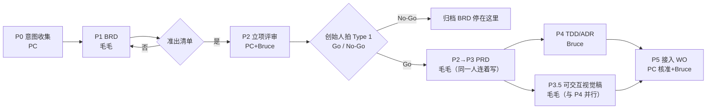
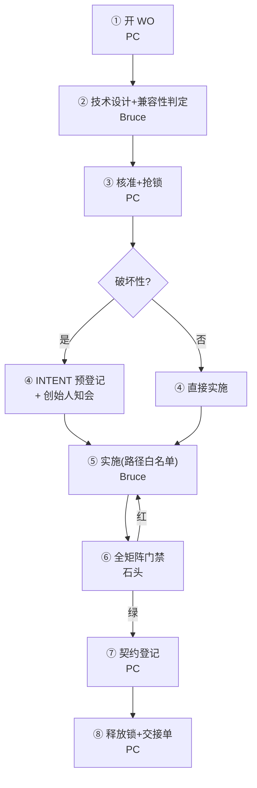
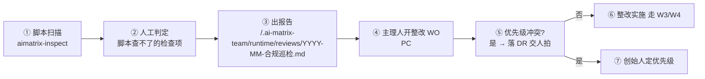

# 05 · 标准工作流（W1–W8）

> 📇 **先读索引卡**：`index/05-workflows.md`（≤30 行速览 + 按节读取指引，避免整读）。会话卫生纪律：Read 带 offset/limit。

> 主理人派单时照此执行。**每个 Workflow 写明：触发 → 参与角色与 Phase → 门禁 → 产出 → DR 落点**。
> 面域与门禁命令见 [`03`](03-shared-surface-control.md)，DR 规范见 [`04`](04-decision-protocol.md)，巡检清单见 [`02`](02-roles.md) §6.1。

---

## W1 · 新 App / 新产品线立项

**触发**：「我要接入 `<App>`」「做个 X 产品」「给矩阵加一条产品线」。

| Phase | 谁 | 产出 | 门禁 |
|---|---|---|---|
| P0 意图收集 | PC | WO（立项单）+ 面域初判 + 拟物名/App ID 待定 | 三要素明确：赛道 / 定位 / 目标人群 |
| P1 BRD | 毛毛 | `<App>_BRD_v1.0_CN.md` | `brd-standard.md` §8 准出清单全过 |
| P2 立项评审 | PC（Bruce 咨询） | `<project>/.ai-matrix-team/runtime/reviews/<App>-立项评审.md` | 共享面影响已初判；技术可行性有结论 |
| **P2.5 人类决策** | 创始人 | — | **Type 1 必须显式签字**（定价/永久免费/合规口径） |
| P3 PRD | 毛毛（**同 P1 同一人**） | `<App>_PRD_v1.0_CN.md` + 验收清单 | 每条需求有可观测 AC；BRD 结论以章节号引用而非复制 |
| P3.5 设计 | 毛毛（**与 P4 并行**） | `apps/<app>/docs/design/` 可交互视觉稿（单份：双主题可点击） | 四阶段两闸门已过：需求摘要确认、状态矩阵八态列全 |
| P4 TDD | Bruce | `<App>_TDD_v1.0_CN.md` + ADR | 破坏性判定明确；迁移 SQL 幂等 |
| P5 接入 | PC → Bruce → 石头 | WO + 契约登记 + 验收 | 全矩阵 typecheck/test/build 绿；登记已追加 |

**DR 落点**：P1 的 Type 1（BLOCKING）· P2 的 Go/No-Go（BLOCKING）· P5 的凭据类（BLOCKING）。
**完成定义**：BRD/PRD/TDD 三件套齐 · 设计稿齐（有 UI 的 App；无 UI 可标 N/A）· Type 1 已签字 · 共享面已登记 · 交接单已落盘。

---

## W2 · 新增变体（「一套源码多 App」）

**触发**：「给 Lucia 加第三个变体」「同一份壳再出一个 App」。
**Phase**：① 毛毛 确认该变体的定位与内容边界 → ② Bruce 复用机制确认（vite `--mode` + alias，禁止 `import.meta.glob('../variants/*')`）→ ③ PC 开 WO：`matrix.config.json` 的 `variants[]` + `shared-types` 登记 AppId（唯一需动共享面的点）→ ④ Bruce 拷贝变体目录 + 配置 → ⑤ 石头 跑**变体隔离断言** + 构建。
**门禁**：`check-variant-isolation.mjs` 必须过（产物互不含对方数据）。
**DR**：内容制作投入是否不可逆（如配音/词表批量生产）→ D1 BLOCKING。

---

## W3 · 共享面变更（**最常走也最容易翻车**）

**触发**：任何触碰 C1/C2 的改动（含「只加一个 AppId」这种看似很小的改动）。

| 步骤 | 谁 | 关键动作 |
|---|---|---|
| ① 开 WO | PC | 填齐影响面 / 验证方式 / 回滚方案（三缺一 → 守卫退回） |
| ② 设计 | Bruce | 兼容性判定（additive / 破坏性）+ 兼容证明（既有消费方行为不变） |
| ③ 核准 | PC（风控例外裁定）| 判级、写路径白名单、`lock acquire` |
| ④ INTENT | PC（风控例外裁定）| 破坏性 → 动手**前**在 `shared-contracts.md` §3 追加 INTENT 条目 |
| ⑤ 实施 | Bruce | 只碰白名单路径；commit 带 WO 号 |
| ⑥ 门禁 | 石头 | 全矩阵 `pnpm -r typecheck` → `test` → `build`；范围由守卫裁定 |
| ⑦ 登记 | PC（风控例外裁定）| **当日**追加 §3 日志（含 WO 号列） |
| ⑧ 收口 | PC | `lock release` + 交接单 |

**DR**：破坏性 → 创始人知会（D3）；跨 App 影响重大 → BLOCKING。
**反例警示**：「只是加个 AppId 而已，顺手改了」→ 这是本流程存在的理由。

---

## W4 · App 内日常开发（轻量）

**触发**：「给 moozi 加个功能」「修 cruru 的 bug」。
**Phase**：① PC 判面域（确认只碰 F 面）→ ② 毛毛（仅当涉及新功能/验收）→ ②.5 毛毛 出稿（仅当涉及新界面/改版；微调样式可跳过）→ ③ Bruce 实现 + 单测 → ④ 石头 门禁（受影响范围，不必全矩阵）→ ⑤ PC 交接单。
**新特性必须走分支开发**：按 **W9** 风险分级执行——新特性属 L2 亲验收（分支 → 门禁+评审 → 提请创始人验收 → 明确验收后 squash 合并）；小修小改走 L1 石头代验收，事后汇报即可。
**不开 WO**（仅 F 面）；**一碰 C1/C2 立刻升级为 W3**（这是最常见的越界点）。
**DR**：需要人类提供素材/凭据 → D2。

---

## W5 · 发布上线

**触发**：「发布 `<App>`」「部署 `<service>`」「执行迁移」。

| 步骤 | 谁 | 动作 | 门禁 |
|---|---|---|---|
| ① 发布评审 | PC + 石头 + 波波 | `<project>/.ai-matrix-team/runtime/reviews/<App>-发布评审.md`：QA 结论、DR 清零、回滚方案 | QA ✅（⚠️ 需创始人确认）· BLOCKING DR 全闭环 |
| ② 部署 | 波波 | `cloudbase-deploy-function.mjs` / 前端按 `matrix.config.json` 托管 | 部署后 healthcheck |
| ③ env / CORS | 波波 | `sync-env.mjs` + `sync-origins.mjs`（**禁止手改** `ALLOWED_ORIGINS`） | `pnpm env:check-ignore` |
| ④ 迁移 | 波波 | `--dry-run` → 确认 → 执行（需云凭据 → DR 授权） | 幂等可重跑 |
| ⑤ 冒烟 | 石头 | 登录 / 权益 / webhook / 创作主链路（含 fail-open 断网验证） | 关键链路全通 |
| ⑥ 记录 | 波波 | 部署记录进交接单 + 回滚方案 | — |

**长期 BLOCKING DR**：生产前必须绑 **ICP 备案自定义域**替换网关默认域（`app-onboarding.md` §六.4）。

---

## W6 · 事故与回滚

**触发**：线上报错、服务不可用、webhook 漏单、数据异常。
**Phase**：① **先止损**（波波 执行回滚 / 开关降级；生产热修可**先修后补单**，24h 内补 WO 标 `EXCEPTION`）→ ② 石头 复现与定位（保留证据：日志/请求 id/时间点）→ ③ Bruce 根因与修复方案（必要时 ADR）→ ④ Bruce 修复 + 补测试（**回归测试即契约**，不许改测试迎合）→ ⑤ PC 事故记录进 `<project>/.ai-matrix-team/runtime/reviews/` + 交接单 + 若暴露流程漏洞则修订本文。
**DR**：涉及对外补偿、资金、用户沟通口径 → D1/D2 BLOCKING（**不许 Agent 自行向用户承诺赔偿**）。

---

## W7 · 决策收口（人类参与的节奏）

**触发**：创始人主动问「有什么等我拍板」/ 每周固定节奏 / 主理人发现有 BLOCKING 未闭环。

1. 跑 `node <team-repo>/scripts/aimatrix-guard.mjs dr scan` → 列出 OPEN 项。
2. 主理人按「阻塞 > Type 1 > 等待时长」排序，输出**一页决策清单**（每项：一句话问题 + 建议默认 + 不做的后果）。
3. 创始人逐条答复（「按默认」即可）。
4. 主理人**回填**：结论写回 BRD/PRD/TDD/ADR/`shared-contracts.md` → DR 移 `closed/` → `<team-repo>/scripts/ledger-sync.mjs` 更新 → `<team-repo>/scripts/render-open-items.mjs` 同步 OPEN-ITEMS。
5. 输出「本轮闭环 N 项，遗留 M 项，其中 BLOCKING K 项」。

---

## W8 · 定期合规巡检（Compliance Sweep）

**触发**：每月一次（建议月初）· 新 App 上线后 1 周 · 大版本发布后 1 周 · 创始人随时要求「查一下 X」。
**执行者**：**石头（唯一）**——他不持共享锁、不核准 WO、不写业务代码，是唯一能审计全队而不自审的人。

| 步骤 | 谁 | 动作 | 门禁 |
|---|---|---|---|
| ① 扫描 | 石头 | `node <team-repo>/scripts/aimatrix-inspect.mjs all --json`（13 项清单见 [`02`](02-roles.md) §6.1） 外加 `install-to-workbuddy.mjs --check`（专家团自身链路） | 脚本退出码 0 = 全通过；非 0 列出违约项 |
| ② 人工判定 | 石头 | 补查脚本查不了的项（BRD 准出质量、配置合理性），写明证据 | 每项有「证据或 N/A」，不许空判 |
| ③ 报告 | 石头 | `<project>/.ai-matrix-team/runtime/reviews/YYYY-MM-合规巡检.md`：每 App 一行结论 + 违约明细 + 建议排期 | **结论不受主理人改写** |
| ④ 开单 | PC | 每个违约项开整改 WO（标 `AUDIT`），P0 红线当轮修 | WO 模板三件套齐 |
| ⑤/⑦ 优先级 | 创始人 | 多个 App 同时违约时，由人定先修谁（DR：NON-BLOCKING 带建议默认） | 7 天内未答复 → 按石头建议排期执行 |
| ⑥ 整改 | Bruce/各角色 | 按违约面域走 W3（受控面）或 W4（App 内） | 复检通过方可关单 |

**红线（立即整改，不等下轮巡检）**：消费 `Entitlement.features` · 秘密入前端/入库 · `matrix.config.json` 不过 schema · 无单改了共享面。
**巡检自身的被巡检**：报告必须写「上次巡检时间 / 距今天数 / 上次未闭环项的处置结论」——漏巡本身记一次流程事故。

---

## W9 · 分支开发与验收合并（硬关卡 · 全 Workflow 通用 · 风险分级）

**适用**：一切代码改动。纯文档/台账改动、WO 归档可直提 main（L0 之外的最轻量豁免仍见分级表）。

### 9.1 验收分级（粒度：风险越高，验收越重）

| 级别 | 覆盖范围 | 验收人 | 等待语义 |
|---|---|---|---|
| **L0 直提** | 文档/台账/WO 归档/CI 微调/单行修复（≤5 行且不触运行时） | 免验收 | 直接 main |
| **L1 代验收** | Bug 修复、UI 微调、App 内小改动（非新功能、不碰共享面/数据/资金） | **石头代验收**：门禁全绿 + 代码评审（实现符合 PRD/契约、无越界、无坏味道）→ PC 事后汇报改了什么 | 7 天无答复按石头建议默认放行（对齐 W7） |
| **L2 亲验收** | **新特性**、共享面变更（C1/C2）、数据迁移/资金/凭据类不可逆操作 | 创始人本人（四步硬关卡见 9.2） | 只提醒不自动放行，分支无限期保持待验收 |

**判级规则**：PC 开单时提议级别并注明理由；创始人可随时上调/下调；拿不准一律就高（L2）；L2 清单内禁止降级放行。每个 WO 的级别写入 WO 头部字段 `验收级别: L0|L1|L2`。

### 9.2 L2 四步硬关卡（缺一不可，顺序固定）

| 步骤 | 谁 | 动作 | 门禁 |
|---|---|---|---|
| ① 开分支 | Bruce | `git checkout -b feat/<WO号>-<短名>`（例 `feat/WO-YYYYMMDD-NN-<短名>`），分支名必带 WO 号 | WO 已准、路径白名单已划、级别已判 |
| ② 开发+评审+测试 | Bruce | 全部 commit 落在特性分支；**石头在分支上做门禁 + 代码评审**（兼代 Review：符合 PRD/契约、无越权路径、单测覆盖主路径） | typecheck/test/build 绿（分支工作树）+ 评审意见闭环 |
| ③ 提请验收 | PC | 门禁与评审全绿后**明确向创始人报告**：分支名 / 改动摘要 / 测试与评审结论 / 预览方式（如可本地起服务给地址），请求验收 | **不得静默合并**；超 7 天 PC 提醒一次，仍不自动放行 |
| ④ 合并 | Bruce | **仅在创始人明确答复「验收通过」后**：打 tag `wo/<WO号>` → `git checkout main && git merge --squash <分支> && git commit`（message 带 WO 号）→ push → 删分支 | squash 后 main 历史一线一特性，可经 tag 回溯完整分支 |

**红线**：
- 测试通过 ≠ 验收通过。门禁绿只解锁第 ③ 步，**L2 合并必须有创始人一句话确认**（「验收通过 / 可以合并 / LGTM」均可，含糊答复须追问）。
- L1 放行由石头署名负责，PC 汇报须写明「L1 代验收 + 石头评审结论」；创始人可抽查，抽查发现质量问题则该类改动当轮升级 L2。
- 用户主动说「直接改 main」时，PC 记一条 NON-BLOCKING DR 留痕后可豁免，但仅限当单。
- 合并后发现回归：按 W6 处理，`git revert <squash commit>`（tag 可快速定位）优先于 hotfix。

**DR**：验收级别争议、验收标准争议 → 创始人拍板（BLOCKING）。

---

## 附：Workflow 与角色调度速查

| Workflow | 参与角色（按顺序） | 是否必开 WO | 人类必经点 |
|---|---|---|---|
| W1 立项 | PC → 毛(BRD) → (B+丹 咨询) → **人** → 毛(PRD) → 蓉+B（并行） → 丹 → PC → 石 | 是（P5 起） | **Type 1 / Go-No-Go** |
| W2 变体 | PC → 毛 → B → 丹 → PC → 石 | 是 | 内容不可逆投入 |
| W3 共享面 | PC → B → **丹** → PC → 石 → 丹 → PC | **是** | 破坏性知会 |
| W4 App 内 | PC → (毛) → (蓉) → PC → 石 → PC | 否（越界即升级 W3） | 凭据/素材 |
| W5 发布 | PC → 石 → 波 → 石 → PC | 是 | 迁移授权 / 域名 |
| W6 事故 | 波 → 石 → B → PC → PC | 事后补（EXCEPTION） | 对外口径 |
| W7 收口 | PC → **人** → PC（回填） | — | 全部答复 |
| **W8 合规巡检** | **石（独立执行）** → PC（开整改单） → (人定优先级) → 各角色整改 | 是（整改单） | 整改优先级冲突时 |
| **W9 分支验收合并** | 分级（9.1）：L0 直提 / L1 石代验收（7 天默认放行）/ **L2 亲验收**（PC 分支 → 石门禁+评审 → PC 提请 → **人验收** → squash 合并+tag） | 沿用所属 WO（头部标 `验收级别`） | **L2 明确验收后才能合并 main** |

> 速查表单字对照：PC=产研高级总监 · 毛=资深产品设计师毛毛 · B=资深研发工程师Bruce · 石=资深质检工程师石头 · 波=资深运维工程师波波。
